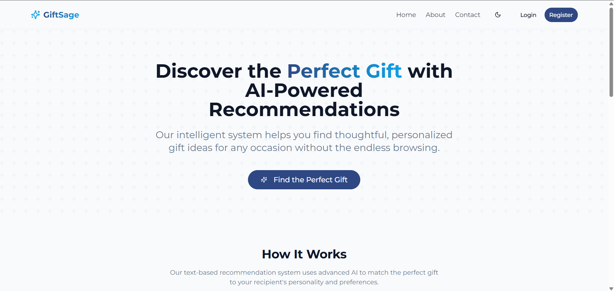

Here’s your content converted into a clean `README.md` file format (Markdown syntax). You can copy this and save it as a file named `README.md` in the **root folder** of your project.

---

```markdown
# Gift Recommendation Platform

Gift Recommendation Platform is an AI-powered web application designed to help users find the perfect gift for their loved ones. It provides personalized gift recommendations based on user preferences, interests, and special occasions.

---

## Table of Contents

- [Overview](#overview)
- [Features](#features)
- [Technologies Used](#technologies-used)
- [Getting Started](#getting-started)
  - [Prerequisites](#prerequisites)
  - [Installation](#installation)
  - [Running the Application](#running-the-application)
- [Folder Structure](#folder-structure)
- [API Endpoints](#api-endpoints)
- [Contributing](#contributing)
- [Acknowledgments](#acknowledgments)
- [License](#license)

---

## Overview

The Gift Recommendation Platform simplifies the process of finding thoughtful gifts for any occasion. Whether it's a birthday, anniversary, or holiday, the platform uses Gemini ai api  to suggest meaningful and unique gifts tailored to the recipient's preferences.
### 🔗 Live Demo  
[Click here to visit the app](https://personalized-gift-recommendation-platform.vercel.app/)

### 📸 Screenshot  


---

## Features

- **AI-Powered Recommendations**: Personalized gift suggestions based on user preferences and interests.
- **User Management**: Admins can manage user accounts, including editing roles and deleting users.
- **Gift Catalog**: Manage a catalog of gifts, including adding, editing, and deleting gift items.
- **Responsive Design**: Fully responsive UI for seamless use on desktop and mobile devices.
- **Authentication**: Secure user authentication using NextAuth.js.
- **Admin Dashboard**: A dedicated admin panel for managing users and gifts.

---

## Technologies Used

- **Frontend**: [Next.js](https://nextjs.org/), [React](https://reactjs.org/)
- **Styling**: [Tailwind CSS](https://tailwindcss.com/)
- **Authentication**: [NextAuth.js](https://next-auth.js.org/)
- **Database**: MongoDB (via [Mongoose](https://mongoosejs.com/))
- **State Management**: React Hooks
- **Icons**: [Lucide React](https://lucide.dev/)
- **UI Components**: Custom components built with Tailwind CSS

---

## Getting Started

### Prerequisites

Before you begin, ensure you have the following installed:

- [Node.js](https://nodejs.org/) (v16 or later)
- [pnpm](https://pnpm.io/) (v7 or later)
- MongoDB (local or cloud-based, e.g., [MongoDB Atlas](https://www.mongodb.com/cloud/atlas))

### Installation

1. Clone the repository:

   ```bash
   git clone https://github.com/your-username/gift-recommendation-platform.git
   cd gift-recommendation-platform
   ```

2. Install dependencies:

   ```bash
   pnpm install
   ```

3. Set up environment variables:

   Create a `.env` file in the root directory and configure the following:

   ```
   DATABASE_URL=mongodb+srv://<username>:<password>@cluster.mongodb.net/<dbname>?retryWrites=true&w=majority
   NEXTAUTH_SECRET=your-secret-key
   NEXTAUTH_URL=http://localhost:3000
   ```

---

## Running the Application

1. Start the development server:

   ```bash
   pnpm dev
   ```

2. Open the application in your browser:  
   [http://localhost:3000](http://localhost:3000)

3. To build the application for production:

   ```bash
   pnpm build
   ```

4. Start the production server:

   ```bash
   pnpm start
   ```

---

## Folder Structure

```
.
├── app/                # Next.js app directory
│   ├── about/          # About page
│   ├── admin/          # Admin dashboard
│   ├── api/            # API routes
│   ├── profile/        # User profile page
│   └── ...             # Other pages and components
├── components/         # Reusable UI components
├── context/            # React context for state management
├── hooks/              # Custom React hooks
├── lib/                # Utility functions and libraries
├── public/             # Static assets (e.g., images, icons)
├── styles/             # Global styles (e.g., Tailwind CSS)
├── types/              # TypeScript type definitions
├── .env                # Environment variables
├── package.json        # Project metadata and dependencies
└── README.md           # Project documentation
```

---

## API Endpoints

### User Management

- `GET /api/admin/users`: Fetch all users  
- `POST /api/admin/users`: Create a new user  
- `PUT /api/admin/users/:id`: Update user details  
- `DELETE /api/admin/users/:id`: Delete a user  

### Gift Management

- `GET /api/admin/gifts`: Fetch all gifts  
- `POST /api/admin/gifts`: Add a new gift  
- `PUT /api/admin/gifts/:id`: Update gift details  
- `DELETE /api/admin/gifts/:id`: Delete a gift  

---

## Contributing

Contributions are welcome! To contribute:

1. Fork the repository  
2. Create a new branch for your feature or bug fix  
3. Commit your changes and push them to your fork  
4. Submit a pull request with a detailed description

---

## Acknowledgments

Thanks to the open-source community for providing tools and libraries that made this project possible.  
Special thanks to contributors who helped improve the platform.


